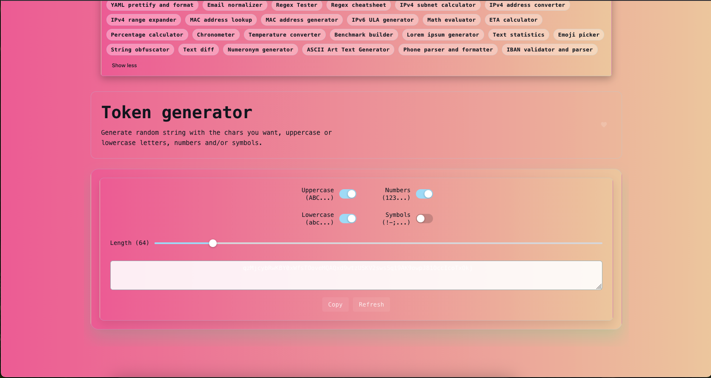

<p align="center">
  
</p>

```sh
pnpm install
```

### Compile and Hot-Reload for Development

```sh
pnpm dev
```

### Type-Check, Compile and Minify for Production

```sh
pnpm build
```

### Run Unit Tests with [Vitest](https://vitest.dev/)

```sh
pnpm test
```

### Lint with [ESLint](https://eslint.org/)

```sh
pnpm lint
```

### Create a new tool

To create a new tool, there is a script that generate the boilerplate of the new tool, simply run:

```sh
pnpm run script:create:tool my-tool-name
```


## Credits

Orignally Coded by [Corentin Thomasset](https://corentin.tech?utm_source=it-tools&utm_medium=readme).Kindly see the orignal repo at https://github.com/CorentinTh/it-tools .This is a work in progress repo and is no means a replacement for the original repo.Infact,I will recommend contributing only to the orignal repo linked above as its a mature project and is well maintaied.I will only accept contribution that are relevant to theme and styling in my repo as my goal is to make it accessible to beginner devs.

